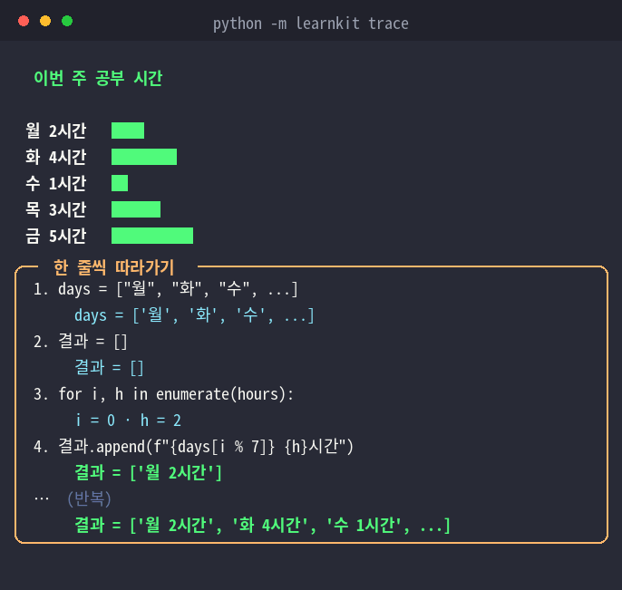
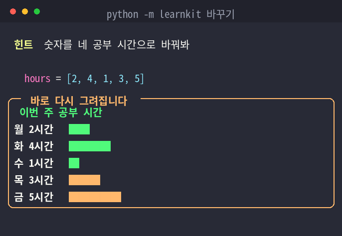
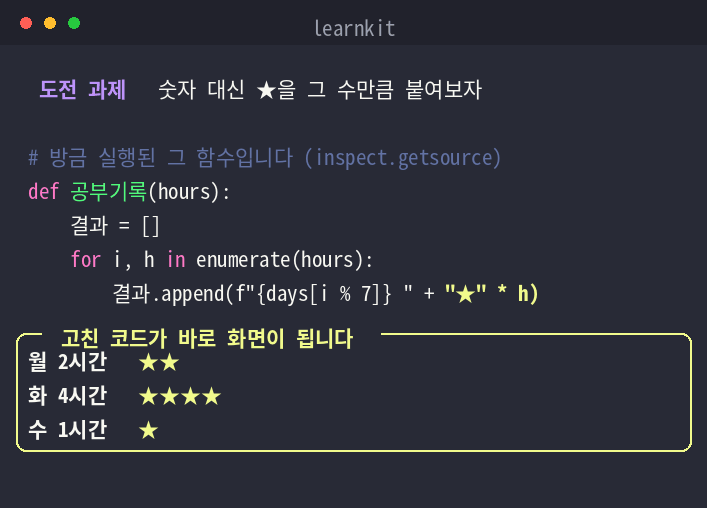
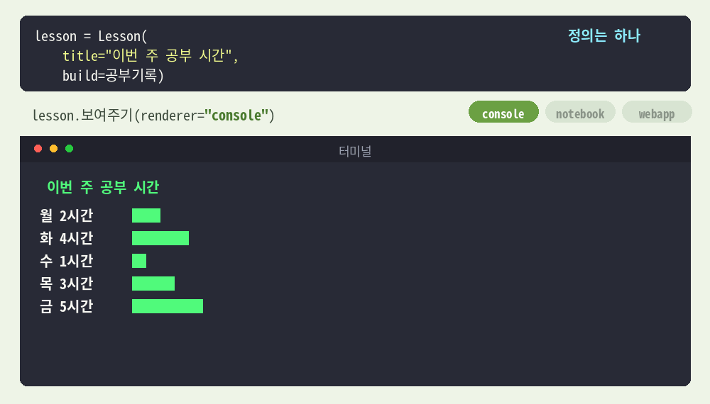
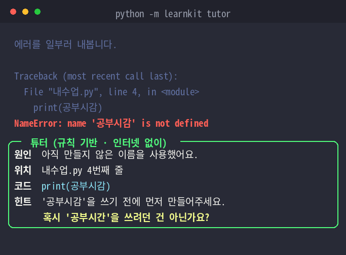
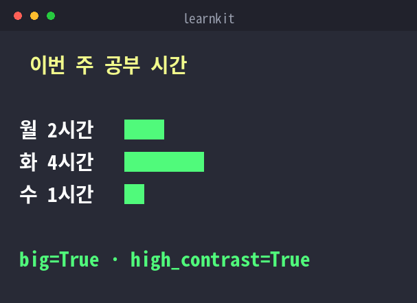

# learnkit

> **하나의 자료는 여러 수준의 사람을 만납니다.**
> 처음 보는 사람에게 맞추면 아는 사람이 지루하고, 아는 사람에게 맞추면
> 처음인 사람이 첫 줄에서 멈춥니다. 가운데를 잡으면 양쪽 다 놓치고요.

특수학급과 일반학급 양 극단을 가르치며 부딪힌 문제인데, 교실만의 문제는 아닙니다 —
README도, 온보딩 문서도, 튜토리얼도 같은 문제를 겪습니다.

learnkit은 자료를 여러 벌로 나누는 대신, **얼마나 펼칠지를 값으로 받습니다.**

```python
lesson = Lesson(title="이번 주 공부 시간", build=공부기록, ...)   # 정의는 한 번

lesson.render_for(Learner.보기부터())        # 결과부터 눈으로
lesson.render_for(Learner.만들어보기())      # 코드를 열고 도전 과제로
```

펼침의 기준은 이론에서 고른 게 아니라, 가르치면서 **학습자가 멈추는 자리**를 보고 정했습니다.

| 흥미가 꺼지는 지점 | learnkit이 하는 일 | 쓰는 파이썬 |
|---|---|---|
| ① 왜 치는지 모를 때 | **한 줄씩 따라가기** — 입력과 결과 사이를 연다 | `sys.settrace` · 프레임 조사 |
| ② 갑자기 어려워질 때 | **난이도 다이얼** — 보기 → 바꾸기 → 만들기 | `inspect.getsource` |
| ③ 결과가 안 보일 때 | **한 정의, 여러 화면** — 콘솔·주피터·웹앱 | `Protocol` 렌더러 · 코드 생성 |
| ④ 에러가 무서울 때 | **에러 튜터** — 원인·위치·코드·힌트 네 칸 | `sys.excepthook` · `difflib` |

[](https://github.com/ji2081/learnkit/actions/workflows/test.yml)


<p align="center">
  
</p>

## 30초 만에 확인하기

```bash
git clone https://github.com/ji2081/learnkit.git
cd learnkit
pip install -e ".[all]"

python -m learnkit           # 같은 정의가 세 수준으로 펼쳐지는 모습
python -m learnkit tutor     # 에러 튜터 (오타까지 찾아줍니다)
python -m learnkit trace     # 코드를 한 줄씩 열어 보기
python -m learnkit new 내수업.py   # 내 수업 파일 뼈대
```

코어만 쓰려면 `pip install -e .` — 추가 의존성 없이 콘솔 렌더와 에러 튜터가 동작합니다.

## 빠른 시작

```python
from learnkit import Lesson

def 번호매기기(items):
    return [f"{i+1}. {x}" for i, x in enumerate(items)]

lesson = Lesson(
    title="반복으로 '내 것' 정리하기",
    build=번호매기기,
    branches={"인문": ["책", "영화", "노래"], "숫자": ["용돈 1000", "간식 2500"]},
    hint="branches를 네가 좋아하는 것들로 바꿔봐.",     # '바꾸기' 단계 도움말
    challenge="번호 대신 '⭐ 항목' 형태로 바꿔보자.",     # '만들기' 단계 도전 과제
    big=True,            # 접근성: 큰 글씨 (학습자가 안 정하면 이 값을 따름)
    high_contrast=True,  # 접근성: 고대비
)

lesson.as_console(branch="인문", dial="보기")     # 콘솔
lesson.as_widget()                                # 주피터 위젯
lesson.as_webapp("app.py")                        # streamlit run app.py
```

## 정의는 한 번, 펼침은 여러 가지

`Lesson`은 **무엇을 다룰지**만 압니다. **어디까지 펼칠지**는 `Learner`가 들고 있습니다.

```python
from learnkit import Learner

수준 = [
    Learner.보기부터("처음 보는 사람"),        # 결과부터, 중간 과정까지 펼쳐서
    Learner.바꿔보기("좀 해본 사람"),          # 직접 바꿔보며, 힌트와 함께
    Learner.만들어보기("더 파고들 사람"),       # 코드를 열고 도전 과제로
]

for 수준값 in 수준:
    lesson.render_for(수준값)
```

정의 1개, 펼침 3가지, 자료 제작 1회.
`Learner`가 비워둔 항목은 `Lesson`의 값을 따릅니다 — 달라져야 하는 것만 적으면 됩니다.

## ① 한 줄씩 따라가기

코드를 따라 치기만 하면 길을 잃는 건, 실행이 한순간에 일어나서입니다.
입력과 결과 사이가 까맣죠. `sys.settrace`로 그 사이를 엽니다.

```python
lesson.as_console(dial="보기", trace=True)
```

```
╭────────── 한 줄씩 따라가기 ──────────╮
│  1. days = ["월", "화", "수", ...]    │
│       days = ['월', '화', '수', ...]  │
│  2. return [f"{days[i % 7]} {h}" ...] │
│       → 결과: ['월 2', '화 4', ...]   │
╰──────────────────────────────────────╯
```

함수 단위로도 쓸 수 있습니다.

```python
from learnkit import walk

result, steps = walk(내함수, [1, 2, 3])
for s in steps:
    print(s.lineno, s.code, s.changed)
```

## ② 난이도 다이얼



같은 정의가 학습자에 따라 세 단계로 늘어납니다. 하나의 자료로 처음 배우는 사람과
더 깊이 가려는 사람을 함께 품기 위한 설계입니다.

| 단계 | 학습자가 하는 일 | 제공되는 도움 |
|------|------------------|---------------|
| 보기   | 결과를 관찰 (코드를 건드리지 않음) | (선택) 한 줄씩 따라가기 |
| 바꾸기 | 데이터를 자신의 것으로 수정 | `hint` 도움말 |
| 만들기 | `build` 함수를 직접 열어 수정 | 코드 공개 + `challenge` 도전 과제 |



## ③ 한 정의, 여러 화면



`Lesson`은 화면을 모릅니다. 화면 그리는 일은 렌더러가 맡고, 둘 사이는 `View`라는
값 하나로만 이어집니다. 렌더러는 상속이 아니라 **Protocol**이라서, 아래 두 가지만
있으면 그것은 이미 렌더러입니다.

```python
from learnkit import register

@register
class 마크다운렌더러:
    name = "markdown"

    def render(self, view, **options):
        return "\n".join(f"| {글} | `{막대}` |" for 글, 막대 in view.rows())

lesson.render("markdown")
```

수업 환경이 특이해도(전자칠판, 점자 단말기, 슬랙 봇…) 각자 붙일 수 있게 하려는 의도입니다.
기본으로 `console` · `widget` · `webapp` · `markdown` · `blocks` 다섯이 들어 있습니다.

### `blocks` — 블록코딩에서 넘어오는 다리

```python
lesson.render("blocks", trace=True)
```

```
┌──────────────────────────────┐
│ ▶ 시작                       │
├──────────────────────────────┤
│ 1. 총합 = 0                  │
│      총합 = 0                │
├──────────────────────────────┤
│ 2. 결과 = []                 │
│      결과 = []               │
├──────────────────────────────┤
│ 3. for h in hours:           │
│      h = 2                   │
├──────────────────────────────┤
│ ■ 끝                         │
└──────────────────────────────┘
```

오조봇·뚜루뚜루 같은 블록코딩에서 학습자가 보는 건 **순서대로 쌓인 명령**입니다.
파이썬도 같은 일을 하는데 화면엔 텍스트 덩어리로만 보이죠.
`trace`로 이미 실행 순서를 갖고 있으니, 그걸 블록으로 세우면
**"블록에서 하던 그 순서가 여기서도 똑같이 일어난다"**가 눈에 보입니다.

한글 표를 그릴 땐 `disp_width` / `pad`를 쓰세요. 한글은 `len()`이 1이지만 화면에서
2칸을 먹어서, 모르면 표 오른쪽 선이 어긋납니다.

`webapp`은 조금 다릅니다 — 화면을 그리는 대신 **혼자 돌아가는 streamlit 코드를 써냅니다.**
생성된 파일은 learnkit 없이도 동작해서, 수업 자료를 파일 하나로 배포할 수 있습니다.

## ④ 에러 튜터



```python
from learnkit import tutor

with tutor():
    print(공부시감)      # '공부시간'의 오타
```

```
╭────────────── 🤖 튜터 (규칙) ──────────────╮
│ 원인  아직 만들지 않은 이름을 사용했어요.    │
│ 위치  lesson.py 6번째 줄                    │
│ 코드  print(공부시감)                        │
│ 힌트  ... 혹시 '공부시간'을(를) 쓰려던       │
│       건 아닌가요?                           │
╰─────────────────────────────────────────────╯
```

오타 추천은 에러가 난 **그 시점의 프레임에서 실제로 존재하던 이름들**을 꺼내
`difflib`으로 비교해 찾습니다. 파이썬 3.10부터는 인터프리터가 비슷한 이름을
알려주지만 영어이고, `sys.excepthook`을 가로채면 그 제안이 사라집니다 —
저희가 하는 일이 바로 가로채는 것이라 한국어로 다시 만들어 붙였습니다. 3.9에는 아예 없습니다.

전역을 건드리고 싶지 않으면 `with tutor():`, 계속 켜두려면 `install()`.
끌 때는 `uninstall()`이 원래 훅으로 되돌립니다.

```python
from learnkit import install, uninstall, register_rule

install(use_llm=False)          # 규칙 기반으로 고정 (오프라인 안전)
register_rule("JSONDecodeError", "JSON 모양이 아니에요.", "따옴표와 쉼표를 확인해 보세요.")
uninstall()
```

`ANTHROPIC_API_KEY`가 있으면 LLM이 설명하고, 없으면 내장 규칙으로 동작합니다.

## AI를 붙이면 (선택 · 기본은 꺼져 있습니다)

> ⚠️ **켜면 학습자가 쓴 코드 줄이 외부 API로 전송됩니다.**
> 미성년 학습자의 코드일 수 있어서 **기본값은 꺼짐**입니다.
> 켜는 것은 그 사실을 알고 하는 명시적 선택이어야 한다고 봤습니다.

키가 없어도 **모든 기능이 그대로 동작합니다.** 학교 컴퓨터에는 키를 넣을 수 없는
경우가 많아서, AI는 처음부터 '있으면 좋은 것'으로 설계했습니다.

```bash
export ANTHROPIC_API_KEY=sk-...
pip install anthropic

python -m learnkit ai        # 켜졌는지 확인
```

```python
with tutor(use_llm=True):    # 명시적으로 켜야 합니다
    ...
```

| | 키 없을 때 | 키 있을 때 |
|---|---|---|
| 에러 설명 | 규칙 19종 + 오타 추천 | 상황에 맞는 설명 (문제가 난 코드 줄까지 보고) |
| 힌트·도전 과제 | 직접 씁니다 | `lesson.suggest()` 가 코드를 보고 만들어 줍니다 |
| 학습자 코드 봐주기 | — | `lesson.review(고친코드)` |

```python
lesson.suggest()            # {"hint": ..., "challenge": ...} 제안만
lesson.suggest(적용=True)    # 비어 있는 항목에만 채움 (쓴 건 안 건드림)

lesson.review(학생이_고친_코드)   # "잘한 점 하나 + 더 해볼 것 하나"
```

자료를 만들 때 제일 오래 걸리는 건 코드가 아니라 힌트입니다.
"뭐라고 써야 스스로 찾을까"를 고민하는 시간이 깁니다. `suggest()`는 그 초안을 만들어 줍니다.

## 접근성



다중 표현(글 + 막대), 고대비, 큰 글씨, 읽어주기(TTS)가 렌더러 공통으로 적용됩니다.
**스크린리더 ARIA와 키보드 내비게이션은 아직 못 했습니다** — 함께 해주실 분을 찾습니다.

## 예제

| 파일 | 내용 |
|------|------|
| `demo_levels.py`      | **한 정의가 세 수준으로 펼쳐지는 모습** |
| `demo_console.py`     | 콘솔 렌더링 3단계 + 웹앱 코드 생성 |
| `demo_widget.ipynb`   | 주피터 위젯 |
| `demo_error_tutor.py` | 에러 튜터 — 없는 이름 · 오타 · 없는 속성 |
| `demo_renderer.py`    | 새 화면 직접 붙여보기 (종이 워크시트) |

## 개발

```bash
pip install -e ".[all]" pytest
python -m pytest
```

설계 의도와 '난이도 다이얼' 패턴은 [docs/DESIGN.md](docs/DESIGN.md)를 참고하세요.

## 아직 모르는 것

**실제 수업에서 써본 적이 없습니다.** 흥미가 꺼지는 네 지점은 가르치며 반복해서
봤지만, 이 도구가 그걸 실제로 되살리는지는 아직 확인하지 못했습니다.

그래서 같이 써보실 분을 찾습니다. 써보시고 안 되는 점을 알려주시는 게
지금 이 프로젝트에 가장 필요한 기여입니다.

## 기여

[CONTRIBUTING.md](CONTRIBUTING.md)에 지금 열려 있는 과제를 적어뒀습니다.
이슈와 PR을 환영합니다.

## 발표

PyCon Korea 2026에서 이 도구를 만들며 겪은 것들을 이야기합니다.

**「블록코딩부터 AI까지 가르치며 만든 파이썬 학습 도구」** · 유수빈 · 정지민

README의 화면들은 `tools/make_demo_gifs.py`가 프레임을 그려 만듭니다. 화면 녹화가 아닙니다.

## 라이선스

MIT
